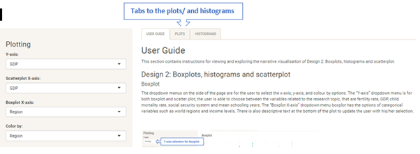
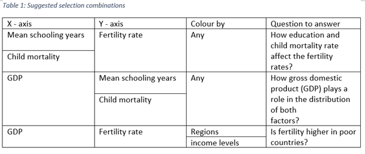

# R-shinny Visualisation - Link between Fertility Rate and Income :baby:
## Introduction

This shiny application is designed to interactively visualise the relationship between income and fertility based on the collected data which are wrangled and presented in the `Data Table` Tab. The main question for the visualization project is “Why is fertility rate higher in poor countries?”, and the sub-questions of it are “How education, child mortality rate, and social security system affect the fertility rates?” and “How gross domestic product (GDP) plays a role in the distribution of these three factors?” 

**APP Link:** [Visualisation Dashboard: Link between Fertility Rate and Income](https://sinyee-neo.shinyapps.io/Fertility_Income_Link/)

## Navigation - Six Interfaces

1. Main page: The main page provide introduction of the application, the source of data used, application usage for each design, and shiny package used for the application. 

2. User guide: This section contains instructions for viewing and exploring the narrative visualisaiton.

3. Design 1: Contains a map and a regression plot with statistical summary of the plot.

4. Design 2: Contains Boxplots, two histograms and  a scatterplot with bestfit line.

5. Design 3: Bar charts and four scatterplots

6. Data Table: Wrangled and cleaned dataset used in the application.

## Design 1: Map and regression plot
* **Map** 
The map provides a clear display of the selected variables in each country. The different in the values of the variables can be differentiated with the colour gradient and the size of the circles. The darker and larger of the colour and circle size respective, the larger the value of the selected variables. 

* **Regression plot**
The regression plot and the summary statistics can indicate how correlated are the selected variables. The plot provides an overall display a general trend that gives a clear idea of how education and child mortality rate are effected by the GDP and how these two variables affect the fertility rate, and their corresponding correlation.

**Instructions for viewing and exploring the narrative visualisaiton of Design 1: Map and regression plot:**

#### Map
User can use the dropdown menus to select different variables to be presented in the map with different colour gradient and circle sizes.The darker and larger of the colour and circle size respective, the larger the value of the selected variables. 


Figure 1. Interactive map with user guide

#### Regression
The selected y value (colour) and x value (size) will go be used to plot the regression line and get the summary statistics (correlation and averages) of the variables. The regression plot is also interactive, and size and alpha can also be adjusted. The user is able to hover over the datapoints on the regression plot, and this will tell the user the details of the points.


## Design 2: Boxplots, histograms and scatterplot

* **Boxplots** provide a good way to view the values of each variable by different categorical variables. For example, if the X-axis of the boxplot is chosen as “Income Levels”, the distribution of the values of the selected variables (y-axis) can be compared with different income groups, if the X-axis of the boxplot is chosen as “Region”, the distribution of the values of the selected variables (y-axis) can be compared with different regions of the world. 

* **Scatterplot** can show the relationship between different numerical variables and see how each variable affect one another. By grouping the categorical variables in different colours, the trend of different groups (i.e., regions and income levels) can be easily compared. ‘

* **Histograms** show the distribution of the selected variables for the scatterplot. Although histograms are not able to show the relationship between the variable, it is good to see the general distribution of the selected variables for the scatterplot. Also, by looking at the mode of the histograms, the user know the most count of the value of the selected variables.

**Instructions for viewing and exploring the narrative visualisaiton of Design 2: Boxplots, histograms and scatterplot:**



Figure 3. Interactive boxplot with user guide

#### <u>Boxplot</u>
The dropdown menus on the side of the page are for the user to select the x-axis, y-axis, and colour by options. The “Y-axis” dropdown menu is for both boxplot and scatter plot, the user is able to choose between the variables related to the research topic, that are fertility rate, GDP, child mortality rate, social security system and mean schooling years. The “Boxplot X-axis” dropdown menu boxplot has the options of categorical variables such as world regions and income levels. There is also descriptive text at the bottom of the plot to update the user with his/her selection. 


Figure 3. Interactive boxplot with user guide


#### Scatterplot
The user is able to hover over the datapoints on the scatterplot, and this will tell the user the details of the data point. The user has the option to add the best fit line to the scatter plot by ticking the “add best fit line to Scatterplot” checkbox. The checkbox is ticked by default. There is also a “Colour by” dropdown menu to select which categorical variable to group the data. The selection of the user will be shown in the descriptive text below the plot. The opacity of the datapoints in the scatter plot need to to be adjusted to view the best fit line clearer. The opacity and size of the datapoints can be adjusted with the “Alpha” and “size” slider. 


Figure 4. Interactive boxplot with user guide

The following selection combinations are suggested to the user to answer the questions of the research topic.

 

#### Histogram
Interactive histograms (hover over for values) for X and Y selections from dropdown menu. Number of bins can be selected from the slidebar. The user is able to hover over the datapoints on the bins of histograms, and this will tell the user the details of the bin.
 


Figure 5. Interactive boxplot with user guide


## Design 3: Bar charts and scatterplots

* **Bar Chart** can provide an overall comparison on the fertility rate with different income group and regions within specific income group. It is a two levels bar chart that enable user to see how the fertility rate of different country regions from different income group differ from each other. For example, if the user select the bar of "Low income", some of the trend such as Mean Schooling Year vs log(GDP) will not show a correlated trend due to the extreme and low variation of values. "Lower middle income" and "Upper middle income" on the other hand will give a better closed to linear trend. 

* **Scatterplots** combine with the drill down function of bar chart to present the general trend of each variable in different income group and regions within specific income group. From the plots, user is able to indicate how fertility rate is affected by the mean schooling year and mortality rate, and how mean schooling year and mortality rate are affected by the GDP. 

**Instructions for viewing and exploring the narrative visualisaiton of Design 3: Bar charts and scatterplots:**

#### Bar Chart
The bar chart contains two levels where the user is able to click on the bar to drill down into sub-categories of the chosen category. In this case, the first level categories are the income levels, the second level categories are the world regions. Also, the user is able to hover over the bars on the bar chart, and this will tell the user the average of the fertility rate for that particular category.


Figure 6. Interactive map with user guide

#### Scatterplot
Depending on which bar the user choose, the scatterplots will be based on the selected category. The user is able to hover over the datapoints on the scatterplots, and this will tell the user the details of the points.


Figure 6. Interactive map with user guide

## Data
Data Wrangling and data cleansing are carried out to clean, restructure and enrich the raw data into one format that is suitable for data analysis. The final dataset is presented in the `Data Table` Tab. The data used by this shiny application are:

**Dataset 1:** GDP per capita across regions 1960 – 2019. It is a tabular data containing 265  rows x 64 column. [Link](https://data.worldbank.org/indicator/NY.GDP.MKTP.CD)

**Dataset 2:** Fertility rates (Total, births per women) across regions 1960 – 2019. It is a tabular data that contains 265 rows x 64 columns. [Link](https://data.worldbank.org/indicator/SP.DYN.TFRT.IN)

**Dataset 3:** National average learning outcomes across regions 1700 – 2015. Is is a tabular data that contains 20251 rows x 6 columns. [Link](https://ourworldindata.org/grapher/learning-outcomes-1985-vs-2015)

**Dataset 4:** Mean years of schooling across regions 1870 – 2017. It is a tabular data that contains 7764 rows x 4 columns. [Link](https://ourworldindata.org/grapher/learning-outcomes-1985-vs-2015)

**Dataset 5:** Infant mortality rates cross the globe (total, deaths/1000 live births) 1960 – 2019. It is a tabular data containing 264  rows x 64 columns. [Link](https://data.worldbank.org/indicator/SP.DYN.IMRT.IN)

### References

Mean years of schooling (years) |Human Development Reports. (2019). Retrieved September 18, 2020, from http://hdr.undp.org/en/indicators/103006 

Data. (n.d.). Retrieved September 18, 2020, from https://www.gapminder.org/data/ 

Fertility rate, total (births per woman) | Data. (n.d.). Retrieved September 18, 2020, from https://data.worldbank.org/indicator/SP.DYN.TFRT.IN 

GDP (current US$) | Data. (2019). The World Bank. https://data.worldbank.org/indicator/NY.GDP.MKTP.CD 

Mortality rate, infant (per 1,000 live births) | Data. (n.d.). Retrieved September 18, 2020, from https://data.worldbank.org/indicator/SP.DYN.IMRT.IN 

World Bank Country and Lending Groups – World Bank Data Help Desk. (n.d.). Retrieved September 18, 2020, from https://datahelpdesk.worldbank.org/knowledgebase/articles/906519-world-bank-country-and-lending-groups?fbclid=IwAR1tYxFXXlXf7Adc3k4-OcYOEvrgeybxqDNsSdtZz0hZave1oDysSukHyX0 

## Package dependencies & credits

This application depends on R-package functions mainly leaflet, ggplot2, and Shiny.  

### Package dependencies:  
```
shinydashboard
shiny
dplyr
readr
readxl
plotly
shiny
ggplot2
dplyr
shinythemes
openintro
plotly
DT
dplyr
readxl
leaflet
```
