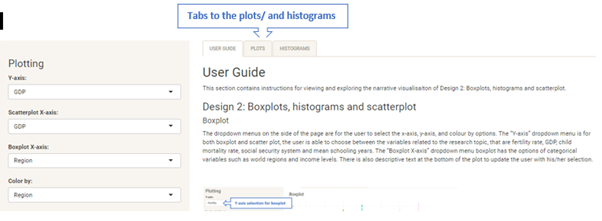
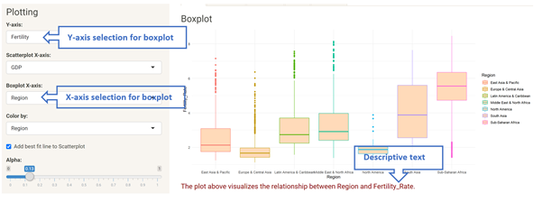
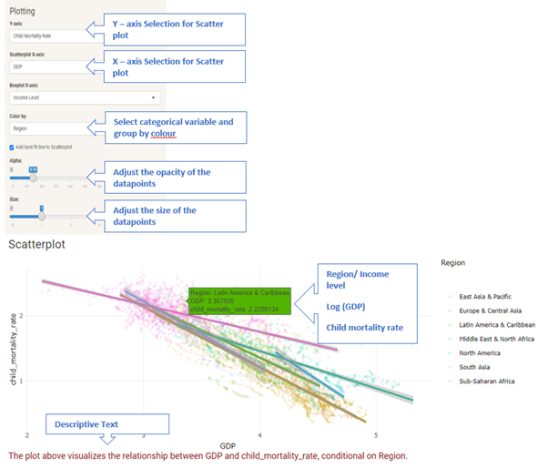
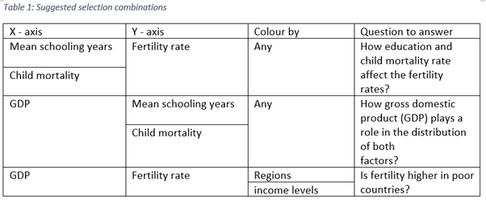
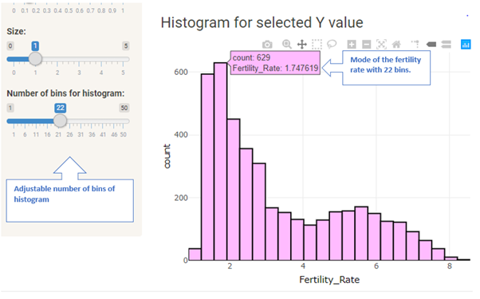

## User Guide

This section contains instructions for viewing and exploring the narrative visualisaiton of Design 2: Boxplots, histograms and scatterplot.

   
  
Figure 3. Interactive boxplot with user guide
 

### Design 2: Boxplots, histograms and scatterplot 
#### Boxplot
The dropdown menus on the side of the page are for the user to select the x-axis, y-axis, and colour by options. The “Y-axis” dropdown menu is for both boxplot and scatter plot, the user is able to choose between the variables related to the research topic, that are fertility rate, GDP, child mortality rate, social security system and mean schooling years. The “Boxplot X-axis” dropdown menu boxplot has the options of categorical variables such as world regions and income levels. There is also descriptive text at the bottom of the plot to update the user with his/her selection. 

   
  
Figure 3. Interactive boxplot with user guide
 

#### Scatterplot
The user is able to hover over the datapoints on the scatterplot, and this will tell the user the details of the data point. The user has the option to add the best fit line to the scatter plot by ticking the “add best fit line to Scatterplot” checkbox. The checkbox is ticked by default. There is also a “Colour by” dropdown menu to select which categorical variable to group the data. The selection of the user will be shown in the descriptive text below the plot. The opacity of the datapoints in the scatter plot need to to be adjusted to view the best fit line clearer. The opacity and size of the datapoints can be adjusted with the “Alpha” and “size” slider. 

   
  
Figure 4. Interactive boxplot with user guide
 

The following selection combinations are suggested to the user to answer the questions of the research topic.

   
  
 

#### Histogram
Interactive histograms (hover over for values) for X and Y selections from dropdown menu. Number of bins can be selected from the slidebar. The user is able to hover over the datapoints on the bins of histograms, and this will tell the user the details of the bin.

   
  
Figure 5. Interactive boxplot with user guide
 

